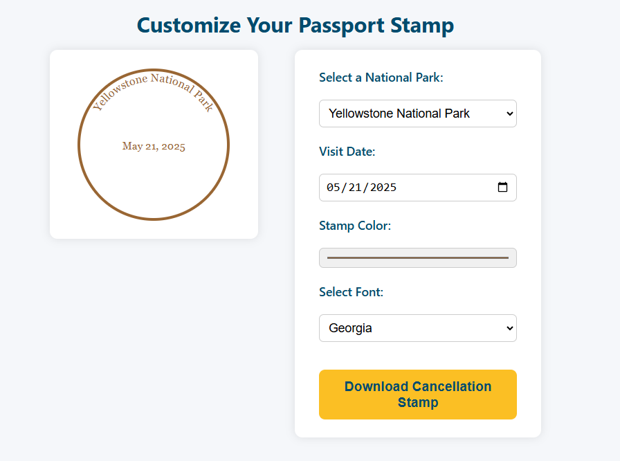
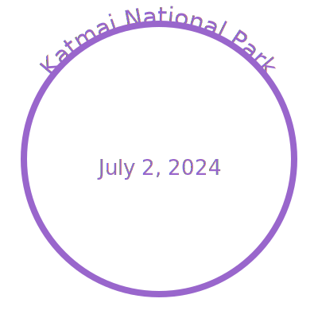
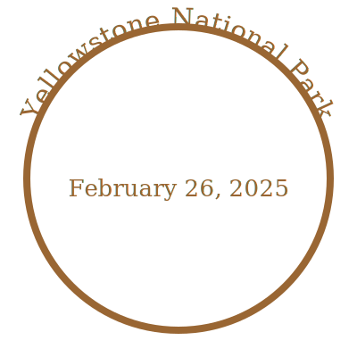
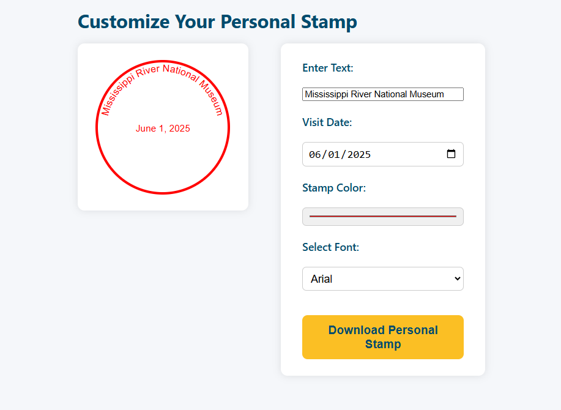
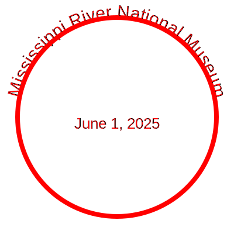

 # 🏞️ National Park Passport Stamp Generator

 This web application lets users generate custom National Park Passport Stamps. Users can select a park from a CSV list, view the park name wrapped along a circle, set a visit date, choose a stamp color based on the park's state, and download the stamp as an SVG file. This repo also includes a Python script to scrape a list of National Park units from wikipedia. 

 ## 🔧 Features

 -  Load National Parks from a CSV file
 -  Automatically color stamps based on the state of the selected park
 -  Customize visit dates, line color, and font
 -  Download the stamp as an SVG
 -  Customize your own text and download as an SVG


 ## 🎖️ Using the National Site Stamp Generator
 The application runs as an index.html file with supporting css and js. The HTML file handles all customization and downloading SVGs to your local device. The first tab, "Customize Passport Stamp", provides a dropdown to select the national site and customize before downloading. 

 ### User Inferface: 
 

 ### Downloaded SVGs: 
 
 


 ## 🎖️ Customizing a Stamp
 The second tab in the interface, "Cutomize Personal Stamp", provides a text field for users to generate their own stamp and download as an SVG. 

 ### User Interface: 
 

 ### Downloaded SVGs:
 


 ## 📁 Project Structure

  .  
 ├── index.html         # Main HTML page  
 ├── script.js          # Handles CSV parsing, UI logic, and SVG rendering  
 ├── style.css          # Core styling  
 ├── national_sites.csv # CSV file with National Park and State info  
 ├── README.md          # Additional information about this repository and use of interfaces  
 ├── images             # Supporting images for README file  


 ## 📊 CSV Format

 The national_sites.csv file should contain:

Park Name,State
 Yellowstone National Park,Wyoming
 Grand Canyon National Park,Arizona
 ...


 ## 🚀 Getting Started with Repository

 1. Clone the repository:

    ```git clone https://github.com/your-username/nps-stamp-generator.git```  
    ```cd nps-stamp-generator```  
    

 2. Open index.html in a browser:

    ```open index.html```  
    

 3. Select a park, set your options, and download your custom stamp.

 ## 🎨 Color Mapping

 The color of the stamp is based on the U.S. state the park resides in, using predefined hex values from the stateColors mapping in script.js.

 ## 📦 Dependencies

 - No external libraries required
 - Vanilla HTML, CSS, JavaScript
 - To utilize the Python Wikipedia scrape of National Park units, depeniencies are: requests, Pandas (bs4), BeautifulSoup, csv

 ## 📝 License

 MIT License. See LICENSE for details.

